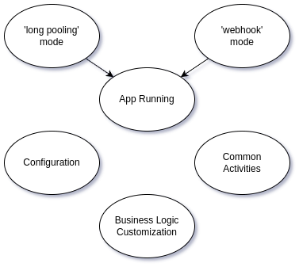

# @flancer32/teq-telegram-bot

A foundational npm package for building Telegram bots using [grammY](https://grammy.dev/)
and [@teqfw/di](https://github.com/teqfw/di).

## Overview

This package facilitates the creation of Telegram bots leveraging the grammY
library ([Habr post](https://habr.com/ru/articles/837610/) in Russian). Key features include:

- Loading bot configuration (e.g., token) from external sources like a JSON file.
- Supporting two operational modes:
    - **Bot mode**: Uses long polling.
    - **Webhook server mode**:
        - Operates over HTTP/HTTP2 behind a proxy.
        - Supports HTTPS as a standalone server.
- Common setup tasks (e.g., registering commands at startup, setting up webhooks).
- Extension points to add custom application logic.



## Installation

To integrate the bot library in an npm application:

```shell
npm i @flancer32/teq-telegram-bot
```

## Usage

The package includes several commands for managing bot modes and server operations:

```shell
./bin/tequila.mjs help
./bin/tequila.mjs tg-bot-start         # Start in long polling mode
./bin/tequila.mjs tg-bot-stop
./bin/tequila.mjs web-server-start     # Start in webhook mode
./bin/tequila.mjs web-server-stop
```

## Configuration

Configure the main application with a `local.json` file in the `./cfg` directory:

```json
{
  "@flancer32/teq-telegram-bot": {
    "apiKeyTelegram": "YOUR_TELEGRAM_API_KEY"
  }
}
```

## API

To implement custom bot logic, create a class that follows the `Telegram_Bot_Back_Api_Setup` interface. This class
should initialize the grammY bot, set up middleware, and define bot commands and handlers.

### Setup Replacement in `@teqfw/di`

Specify the custom setup class in the `./teqfw/json` configuration file to override the default bot setup:

```json
{
  "@teqfw/di": {
    "autoload": {},
    "replaces": {
      "back": {
        "Telegram_Bot_Back_Api_Setup": "YourApp_Back_Bot_Setup"
      }
    }
  }
}
```

Replace `"YourApp_Back_Bot_Setup"` with the fully qualified name of your custom setup class.
